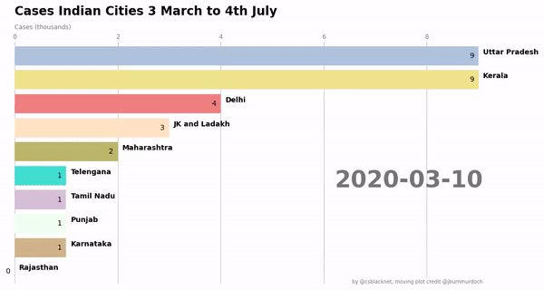

# COVID-19 Racing Animation and Data Collection API

Run the following command to fetch the latest data on COVID-19.

```
python covid19_dataupdater.py
```

This creates two csv files in covid_data folder:
* covid19_statewise.csv : This file will be used to create the racing animation

* covid19_india.csv

After collecting the latest covid data run the cells of jupyter notebook ```matplotlib-covid-racer.ipynb``` which are all self-explanatory:

Animator saves file as im.mp4

